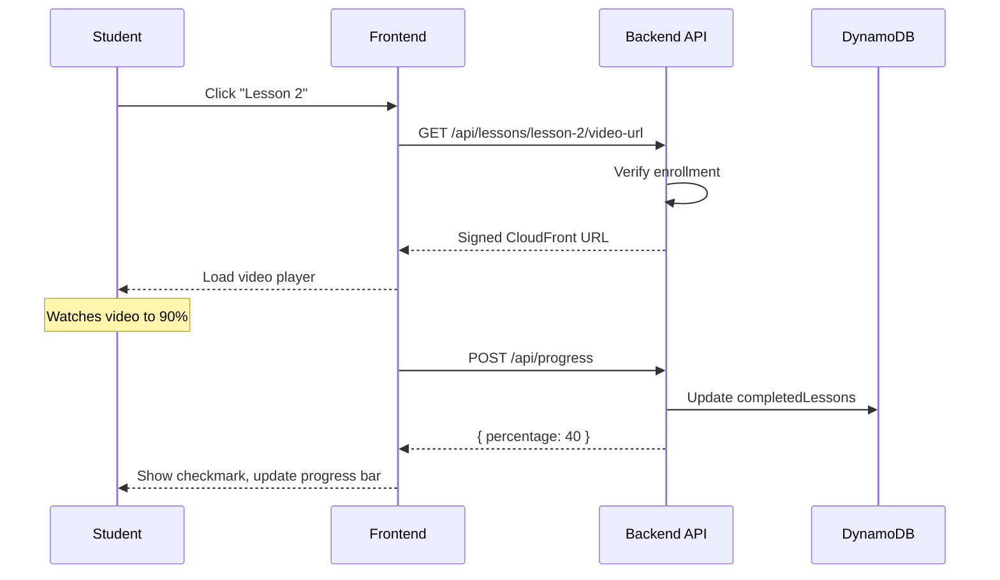
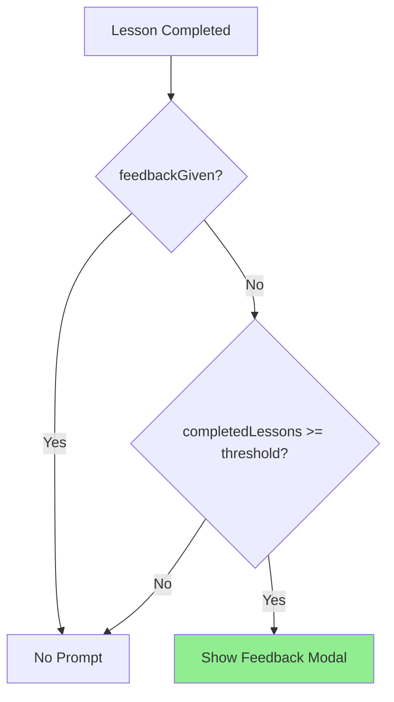

# Spec Planning

Turn user ideas into structured Spec Plans using Spec-Driven Development.

## Spec-Driven Development & Your Role

Spec planning starts with the end in mind. You create a mainspec that defines the complete end state of a feature, then work backwards to identify logical slices—temporal chunks of intent that each focus on a clear WHAT and WHY. Each slice is a manageable piece that can be implemented independently while building toward the complete vision. Your job: research the codebase to understand what exists today, ask clarifying questions to understand user intent, create temporal ordering of mainspecs and slices based on dependencies, and write spec outlines that paint a clear picture of WHAT needs to be built and WHY it matters. Start each slice with clear objectives and user stories to establish context and purpose. The balance: provide clear intent, constraints, and patterns from the actual codebase, but avoid being overly prescriptive about implementation details. Your output is a mainspec plus ordered slices with dependencies explicitly documented, giving implementation agents the right context to succeed.

## Guidelines

- **Research codebase first** - Verify what exists today before planning. Look at specs folder to see what's been done, but verify against actual code since specs may be outdated.
- **Reference the real codebase** - Ground specs in reality with actual file paths, existing patterns, and current implementations. Show what exists today as context for what should exist tomorrow.
- **Ask questions iteratively** - Use AskUserQuestion tool regularly to clarify intent, validate assumptions, and get feedback. This is interactive, not one-shot.
- **Think temporally** - Order mainspecs (which feature comes first?) and slices (which slice enables the next?). Document dependencies clearly.
- **Right level of detail** - Clear enough for implementation agents to understand intent, but not so detailed you make up features or constrain solutions unnecessarily.
- **Document forward requirements** - In each slice, capture what future slices will need from the current work. Prevents rework and enables temporal planning.
- **Focus on WHAT not HOW** - Specs define intent and outcomes, not implementation steps. Use code snippets, exact file paths, and examples for context (see Context Engineering below), but don't write full implementation plans. Paint the picture of WHAT needs to exist and WHY, leaving HOW to the implementation phase.

## Context Engineering in Specs

Context engineering in specs is about choosing what to put in specs to eliminate ambiguity for coding agents. The biggest lever you have is what you include (or exclude) in the spec. Below are key practices to apply when writing specs.

### 1. BEFORE/AFTER with Precise File Paths

When modifying existing code, show exact file path and current state vs desired state. This eliminates ambiguity about what's changing.

**Example:**
```markdown
**File:** `backend/src/features/students/student.types.ts`

**BEFORE (Today):**
```typescript
export interface Student {
  userId: string;
  email: string;
  createdAt: string;
}
```

**AFTER (Tomorrow):**
```typescript
export interface Student {
  userId: string;
  email: string;
  createdAt: string;
  interestedInPremium?: boolean;     // New: early access signup flag
  premiumInterestDate?: string;      // New: ISO timestamp when signed up
}
```
```

### 2. Type Contracts First

Define interfaces, schemas, and data structures upfront before any implementation. This can be an entire slice focused only on types—constraining shape removes ambiguity.

**Example:**
```typescript
// Define all types before implementation
export interface LessonEntity {
  PK: string;              // "COURSE#<courseId>"
  SK: string;              // "LESSON#<lessonId>"
  lessonId: string;
  title: string;
  videoKey: string;        // S3 object key
  order: number;
}

export interface LessonResponse {
  lessonId: string;
  title: string;
  videoUrl: string;        // Signed CloudFront URL (not S3 key)
  isCompleted?: boolean;
}
```

### 3. DO/DON'T Counterexamples

Show one good example and one bad example with explanation of why the bad version fails. Negative examples prevent common mistakes.

**Example:**
```markdown
**DO ✅ - Verify enrollment before serving video URL**
```typescript
const lesson = await getLesson(lessonId);
const isEnrolled = await checkEnrollment(studentId, lesson.courseId);
if (!isEnrolled) {
  return res.status(403).json({ error: 'Not enrolled' });
}
const signedUrl = await generateSignedUrl(lesson.videoKey);
```

**DON'T ❌ - Serve video URLs without authorization**
```typescript
const lesson = await getLesson(lessonId);
const signedUrl = await generateSignedUrl(lesson.videoKey);
// Anyone with lessonId can access video - security vulnerability!
```
```

### 4. Narrative Temporal Flows with MermaidJS

Use MermaidJS diagrams to show causality across system layers. Participants should map to system boundaries (Student, Frontend, Backend API, DynamoDB, etc.).

**Sequence Diagrams** - For temporal flows showing request/response chains:



**Flowcharts** - For decision logic and component relationships:



**Spec-planning conventions:**
- Participants = system layers (not implementation classes)
- Use `style X fill:#90EE90` to highlight new components
- Focus on WHAT happens across boundaries, not HOW it's implemented internally

### 5. Forward-Looking Requirements

Document what future slices/phases will need from the current implementation. Prevents rework and captures dependencies.

**Example:**
```markdown
## Forward-Looking Requirements

### For Slice 1.3 (Progress API)
- Progress percentage calculation: `(completedLessons.length / totalLessons) * 100`
- `totalLessons` must be provided or calculated from Lesson count query

### For Slice 1.4 (Video Player Component)
- Video URL fetching: When user clicks lesson → Call `GET /api/lessons/:lessonId/video-url`
- Progress tracking trigger: When video reaches 90% → Call `POST /api/progress`
```

### 6. BEFORE/AFTER Directory Structure

When adding new components or reorganizing code, show the directory structure with inline comments explaining what's new, what's updated, and why the structure matters.

**Example:**
```markdown
**BEFORE (Today):**
```
backend/
└── email/
    └── handler.ts         # Simple Lambda handler, sends hardcoded emails
```

**AFTER (Tomorrow):**
```
backend/
└── email/
    ├── handler.ts         # Lambda handler (from Slice 4.1) - unchanged
    ├── render.ts          # NEW: Email rendering + event router
    ├── types.ts           # UPDATE: Add event and email data types
    ├── emails/
    │   ├── enrollment-email.tsx  # NEW: React Email template
    │   └── index.ts              # NEW: Export all templates
    ├── components/
    │   ├── header.tsx     # NEW: Reusable email header
    │   ├── footer.tsx     # NEW: Reusable email footer
    │   └── index.ts       # NEW: Export all components
    ├── package.json       # NEW: React Email dependencies
    ├── tsconfig.json      # NEW: TypeScript config for email workspace
    └── .react-email/      # Auto-generated by dev server (gitignored)
```

**Why this structure:**
- `emails/` folder: Templates are separate from rendering logic
- `components/` folder: Shared components for consistent branding
- `render.ts`: Central router handles all email types
- Workspace-specific package.json: Email dependencies isolated from main backend
```

---