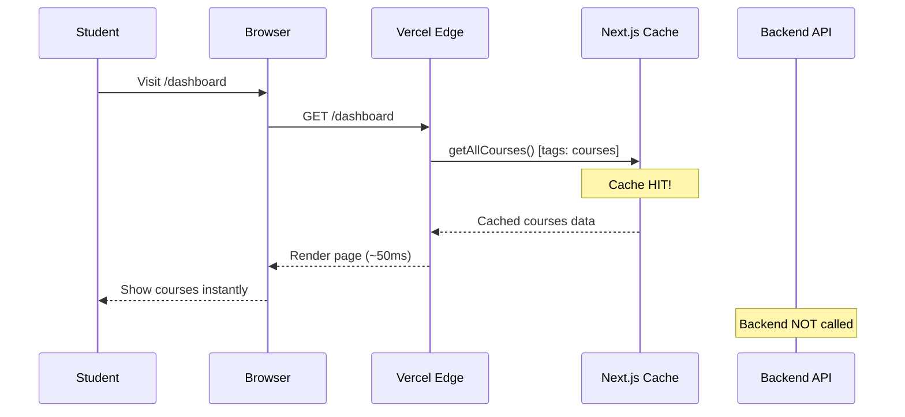
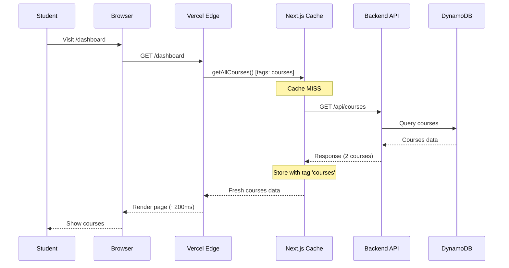
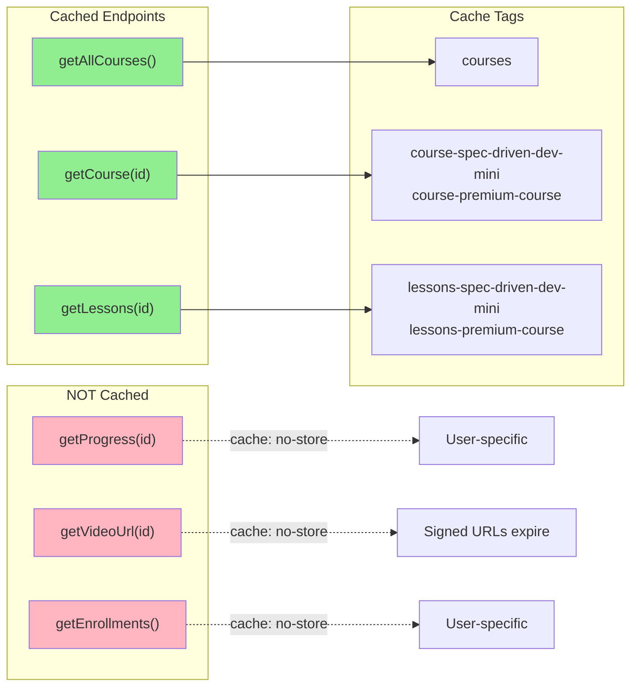

# Feature - Next.js Tag-Based Fetch Caching

## Background

The LearnerMax application currently fetches courses and lessons from the backend API on every request with `cache: 'no-store'`. With only 2 courses (1 mini course and 1 teaser premium course) and infrequent lesson additions, this creates unnecessary API calls and latency for data that rarely changes.

Additionally, the `/course/[courseId]` page has a `generateMetadata()` function that makes an extra API call for course data, duplicating the fetch done in the page component itself. Since this is a protected page (requires authentication), SEO metadata is not needed - a static title like "LearnWithRico" is sufficient.

We want to leverage Next.js's `next: { tags: [...] }` fetch option for tag-based caching. This mainspec covers ONLY the caching setup. Cache invalidation (API endpoint, Bun CLI tools, environment setup) will be handled in a separate feature: `specs/managing_course_content/`.

## User Story

As a student, I want courses and lessons to load quickly. I don't need real-time updates since course content changes infrequently.

## What We're Building

1. **Tag-Based Fetch Caching** - Update fetch calls to use `next: { tags: [...] }` instead of `cache: 'no-store'`
2. **Remove Redundant Metadata Fetch** - Replace `generateMetadata()` in course page with static metadata

## What We're NOT Building

- Backend-level caching (Redis, Memcached, etc.)
- Cache invalidation API or tools (see `specs/managing_course_content/`)
- Per-user cache variations (course/lesson data is the same for all authenticated users)
- SEO metadata for protected pages

## Tech Details

### Architecture

**Current State (Today):**

**File:** `frontend/app/actions/courses.ts:61-68`
```typescript
const response = await fetch(endpoint, {
  method: 'GET',
  headers: {
    'Content-Type': 'application/json',
    'Authorization': `Bearer ${token}`,
  },
  cache: 'no-store', // Always fetch fresh course data
});
```

**File:** `frontend/app/actions/lessons.ts:67-74`
```typescript
const response = await fetch(endpoint, {
  method: 'GET',
  headers: {
    'Content-Type': 'application/json',
    'Authorization': `Bearer ${token}`,
  },
  cache: 'no-store', // Always fetch fresh lesson data
});
```

**File:** `frontend/app/course/[courseId]/page.tsx:29-39`
```typescript
// This makes an extra API call for metadata that duplicates the page fetch
export async function generateMetadata({ params }: CoursePageProps): Promise<Metadata> {
  const { courseId } = await params;
  const courseResult = await getCourse(courseId);  // Duplicate call!

  if ('course' in courseResult) {
    return {
      title: `${courseResult.course.name} - LearnWithRico`,
      description: courseResult.course.description,
    };
  }
  // ...
}
```

---

**Future State (After This Mainspec):**

**File:** `frontend/app/actions/courses.ts`

**BEFORE:**
```typescript
const response = await fetch(endpoint, {
  method: 'GET',
  headers: {
    'Content-Type': 'application/json',
    'Authorization': `Bearer ${token}`,
  },
  cache: 'no-store',
});
```

**AFTER:**
```typescript
const response = await fetch(endpoint, {
  method: 'GET',
  headers: {
    'Content-Type': 'application/json',
    'Authorization': `Bearer ${token}`,
  },
  next: { tags: ['courses'] },  // Tag-based caching with manual invalidation
});
```

**File:** `frontend/app/course/[courseId]/page.tsx`

**BEFORE:**
```typescript
export async function generateMetadata({ params }: CoursePageProps): Promise<Metadata> {
  const { courseId } = await params;
  const courseResult = await getCourse(courseId);
  // ... fetch course just for metadata
}
```

**AFTER:**
```typescript
// Static metadata - no API call needed for protected page
export const metadata: Metadata = {
  title: 'Course - LearnWithRico',
};
```

### Cache Tagging Strategy

Simple tagging strategy for 2 courses:

| Data Type | Cache Tag | Invalidate When |
|-----------|-----------|-----------------|
| All courses list | `courses` | Course added/removed/modified |
| Single course | `course-{courseId}` | Specific course metadata changes |
| Lessons for course | `lessons-{courseId}` | Lesson added/removed/modified for course |

**Tag Examples:**
- `courses` - For `getAllCourses()` - dashboard, landing page
- `course-spec-driven-dev-mini` - For `getCourse('spec-driven-dev-mini')`
- `lessons-spec-driven-dev-mini` - For `getLessons('spec-driven-dev-mini')`

### Technology Stack

- **Caching**: Next.js `next: { tags: [...] }` fetch option
- **Hosting**: Vercel (already in use)

### Domain Language

- **Cache Tag**: A string identifier used to group cached fetch responses for invalidation
- **Tag-Based Caching**: Caching strategy where data is tagged and can be invalidated by tag name

## Architecture Narrative

### Cache Flow Diagrams

#### Cache HIT Flow (Fast Path)



#### Cache MISS Flow (First Request)



#### Endpoint-Specific Caching



## URL Structure

No new URL structures - this feature modifies existing fetch behavior only.

## Data Models

No new data models - this feature operates at the caching layer only.

## Do / Don't Examples

### DO: Use `next: { tags }` for Controlled Data

```typescript
// GOOD: Tag-based caching for data you control when it changes
const response = await fetch(endpoint, {
  method: 'GET',
  headers: { 'Authorization': `Bearer ${token}` },
  next: { tags: ['courses'] },
});
```

### DON'T: Use Tag Caching for User-Specific Data

```typescript
// BAD: Progress is user-specific and changes frequently
const response = await fetch(`/api/progress/${courseId}`, {
  headers: { 'Authorization': `Bearer ${token}` },
  next: { tags: ['progress'] },  // DON'T - user-specific data
});

// GOOD: Keep no-store for user-specific data
const response = await fetch(`/api/progress/${courseId}`, {
  headers: { 'Authorization': `Bearer ${token}` },
  cache: 'no-store',  // Progress changes frequently per user
});
```

### DO: Use Static Metadata for Protected Pages

```typescript
// GOOD: Static metadata for authenticated pages
// File: app/course/[courseId]/page.tsx
export const metadata: Metadata = {
  title: 'Course - LearnWithRico',
};
```

### DON'T: Fetch Data Just for Metadata on Protected Pages

```typescript
// BAD: Duplicate API call for metadata on protected page
export async function generateMetadata({ params }) {
  const course = await getCourse(params.courseId);  // Extra API call!
  return { title: course.name };
}
```

### DO: Use Simple, Descriptive Tags

```typescript
// GOOD: Clear, hierarchical tags
next: { tags: ['courses'] }                        // All courses
next: { tags: ['course-spec-driven-dev-mini'] }    // Specific course
next: { tags: ['lessons-spec-driven-dev-mini'] }   // Lessons for course
```

### DON'T: Over-Engineer Tags for 2 Courses

```typescript
// BAD: Too granular for simple use case
next: { tags: ['course-metadata-spec-driven-dev-mini'] }
next: { tags: ['course-curriculum-spec-driven-dev-mini'] }
next: { tags: ['course-pricing-spec-driven-dev-mini'] }
```

## Forward-Looking Requirements

### 1. Progress/Enrollment Data (NOT Cached)

User-specific data should **NOT** use tag-based caching:
- Progress changes every video watched
- Enrollment status is user-specific
- Keep `cache: 'no-store'` for these

### 2. Future Premium Course Content

When premium courses launch with more lessons:
- Same tagging strategy applies: `lessons-{courseId}`
- No changes needed to the caching architecture

### 3. Video URLs (NOT Cached)

Video URLs should remain uncached:
- Signed URLs expire after 30 minutes
- Each request should get a fresh signed URL
- Keep `cache: 'no-store'` for video URL fetches

### 4. Cache Invalidation (Separate Feature)

Cache invalidation is NOT part of this mainspec. When course content is updated, cache invalidation will be handled by the `managing_course_content` feature which includes:
- Vercel revalidation API endpoint (`/api/revalidate`)
- Bun CLI tools for cache invalidation
- Environment variable setup (`REVALIDATE_SECRET`)

See `specs/managing_course_content/input.md` for planning details.

## Deliverables

By the end of this mainspec:

1. **Server Action Updates**
   - `getAllCourses()` uses `next: { tags: ['courses'] }`
   - `getCourse(courseId)` uses `next: { tags: ['course-{courseId}'] }`
   - `getLessons(courseId)` uses `next: { tags: ['lessons-{courseId}'] }`

2. **Course Page Optimization**
   - Remove `generateMetadata()` from `/course/[courseId]/page.tsx`
   - Replace with static `metadata` export

3. **Testing**
   - Verify cache works (check response times in Vercel logs)
   - Dashboard loads faster on subsequent visits
   - Course page only makes one API call for course data

## Slices Breakdown

1. **Slice 7.1: Tag-Based Fetch Caching** - Update `courses.ts` and `lessons.ts` to use `next: { tags }`, remove `generateMetadata()` from course page

See `specs/caching/slices/slice-7.1-tag-based-fetch-caching.md` for detailed implementation.
