# Feature: Next.js 16 Cache Components + SWR Performance Optimization

## Background

The LearnerMax application has performance issues on the dashboard and course pages:

1. **Dashboard bypasses caching** - All data fetching happens client-side via `useEffect`, completely bypassing Next.js Data Cache
2. **Course page has sequential waterfalls** - Auth, enrollment check, and course fetch happen sequentially
3. **No client-side caching** - Every navigation triggers fresh API calls
4. **No prefetching** - Users wait for lesson determination logic after clicking a course

## User Stories

**As a student**, I want the dashboard to load instantly so I can quickly see my courses and progress.

**As a student**, I want course pages to load fast, with content rendering progressively.

**As a student**, I want to click on a course and immediately go to the right lesson without waiting.

**As a student**, I want my progress to update instantly when I complete a lesson.

## What We're Building

1. **Next.js 16 Cache Components** - Use `"use cache"` directive for static data (courses, lessons, meetups)
2. **SWR Integration** - Client-side caching with optimistic updates for user-specific data
3. **Prefetching** - Pre-load course pages from dashboard using `router.prefetch()`
4. **Optimistic Updates** - Instant UI feedback on mutations (enrollment, progress, interest)

## What We're NOT Building

- Backend-level caching (Redis, Memcached)
- Full static site generation (pages require auth)
- Service worker / offline support
- Real-time WebSocket updates

---

## Architecture Diagrams

### Dashboard Page Data Flow


### Course Page Data Flow


### SWR Caching Behavior

```mermaid
sequenceDiagram
    participant U as User
    participant C as Component
    participant S as SWR Cache
    participant A as API

    Note over U,A: First Visit
    U->>C: Navigate to Dashboard
    C->>S: useEnrollments()
    S->>A: fetch /api/enrollments
    A-->>S: enrollments[]
    S-->>C: data (cached)

    Note over U,A: Navigation Within App
    U->>C: Navigate to Course → Back to Dashboard
    C->>S: useEnrollments()
    S-->>C: Return cached data immediately ✨
    S->>A: Revalidate in background
    A-->>S: Updated data (if changed)

    Note over U,A: Optimistic Mutation
    U->>C: Click "Enroll"
    C->>S: mutate([...enrollments, new], false)
    S-->>C: Instant UI update ✨
    C->>A: enrollInCourse(courseId)
    A-->>C: Success
    C->>S: mutate() - revalidate
    S-->>C: Confirmed server state
```



### Cache Components Behavior


### Prefetching Flow

```mermaid
flowchart LR
    subgraph "Dashboard"
        A[CourseCard mounts] --> B["useProgress(courseId)"]
        B --> C["computePrefetchUrl()"]
        C --> D["router.prefetch(url)"]
    end

    subgraph "Next.js"
        D --> E[Prefetch /course/xyz?lesson=3]
        E --> F[Cache route data]
    end

    subgraph "User Action"
        G[User clicks course] --> H[Instant navigation ⚡]
    end

    F --> H
```



---

## Data Classification

| Data Type | Caching Strategy | Cache Profile | Invalidation |
|-----------|------------------|---------------|--------------|
| **Courses** | `"use cache"` + `cacheTag('courses')` | `'max'` | Script-based `revalidateTag` |
| **Lessons** | `"use cache"` + `cacheTag('lessons-{id}')` | `'max'` | Script-based `revalidateTag` |
| **Meetups** | `"use cache"` + `cacheTag('meetups')` | `'minutes'` | On zoomLink update |
| **Student** | SWR client-side | N/A | Optimistic updates |
| **Enrollments** | SWR client-side | N/A | Optimistic on enroll |
| **Progress** | SWR client-side | N/A | Optimistic on complete |
| **Video URLs** | **NEVER CACHED** | N/A | Signed URLs expire every 30 min |

**Notes:**
- Courses/lessons require enrollment to access, so auth token is passed as argument (per-user cache key).
- **Video URLs must NEVER be cached** - `getVideoUrl()` returns pre-signed S3 URLs that expire after 30 minutes. Caching would cause video playback failures.

---

## Key Architectural Decisions

### 1. Meetups Simplification
- Move `signedUpMeetups: string[]` array to Student `/me` endpoint
- Meetup API returns static data only (no user-specific fields)
- `isSignedUp` derived client-side: `student.signedUpMeetups.includes(meetupId)`
- `isRunning` calculated server-side, cached with `cacheLife('minutes')`

### 2. Server Actions Refactoring
- **Reads become async functions with `"use cache"`** (not server actions)
- **Mutations stay as server actions** (`'use server'`)
- **Auth tokens passed as arguments** to cached functions (can't use cookies() inside `'use cache'`)

### 3. Suspense Strategy
- Minimal: One Suspense boundary for user-specific data section
- Static course/meetup data renders immediately
- User-specific data (enrollments, progress) streams in via Suspense

### 4. Prefetching Strategy
- **Dashboard -> Course Page**: `router.prefetch()` in CourseCard on render
- Compute prefetch URL using `lastAccessedLesson` from progress data
- Lesson URL format: `/course/{courseId}?lesson={lessonId}`

### 5. Optimistic Updates
- **Enrollment**: Instantly add course to enrollments list
- **Progress**: Instantly update `completedLessons` and percentage
- **Student interest**: Instantly show "Interested!" state

---

## File Structure After Migration

```
frontend/
├── app/
│   ├── actions/
│   │   └── mutations/           # Server actions for writes only
│   │       ├── enrollments.ts
│   │       ├── progress.ts
│   │       ├── meetups.ts
│   │       └── students.ts
│   ├── dashboard/
│   │   └── page.tsx             # Server component with 'use cache'
│   └── course/[courseId]/
│       └── page.tsx             # Server component with 'use cache'
├── lib/
│   ├── data/                    # Async functions with 'use cache'
│   │   ├── courses.ts
│   │   ├── lessons.ts
│   │   ├── meetups.ts
│   │   ├── students.ts
│   │   ├── enrollments.ts
│   │   └── progress.ts
│   └── swr-config.tsx           # SWRConfig provider
├── hooks/
│   ├── useStudent.ts            # SWR hook
│   ├── useEnrollments.ts        # SWR hook
│   └── useProgress.ts           # SWR hook
└── next.config.ts               # cacheComponents: true
```

---

## Cache Profiles Summary

| Function | Profile | Rationale |
|----------|---------|-----------|
| `getAllCourses()` | `'max'` | Rarely changes, invalidate via script |
| `getCourse(id)` | `'max'` | Rarely changes, invalidate via script |
| `getLessons(id)` | `'max'` | Rarely changes, invalidate via script |
| `getMeetups()` | `'minutes'` | `isRunning` changes based on time |

---

## Slices

| Slice | Name | Description |
|-------|------|-------------|
| 1 | Enable Cache Components | Add `cacheComponents: true` to next.config.ts |
| 2 | Refactor Data Fetching | Convert server actions to `"use cache"` functions |
| 3 | Mutations as Server Actions | Keep mutations separate with `'use server'` |
| 4 | SWR Hooks | Create hooks with optimistic updates |
| 5 | Backend signedUpMeetups | Add meetup signups to Student endpoint |
| 6 | Dashboard Migration | SSR with Cache Components + SWR hydration |
| 7 | Course Page Migration | Parallel cached fetching + SWR progress |
| 8 | Prefetching | `router.prefetch()` on CourseCard render |

---

## Dependencies Between Slices

```
Slice 1 (Config)
    ↓
Slice 2 (Data Functions) ← Slice 5 (Backend)
    ↓
Slice 3 (Mutations) + Slice 4 (SWR Hooks)
    ↓
Slice 6 (Dashboard) + Slice 7 (Course Page)
    ↓
Slice 8 (Prefetching)
```

---

## Technology Stack

- **Server Caching**: Next.js 16 Cache Components with `"use cache"` directive
- **Client Caching**: SWR v2 with optimistic updates
- **Prefetching**: Next.js `router.prefetch()`
- **State Management**: SWR handles all client state (no Redux/Zustand needed)

---

## Deliverables

By the end of this feature:

1. **Dashboard Performance**
   - First contentful paint: <500ms (from ~2500ms)
   - Courses visible immediately (SSR + cache)
   - Progress updates without full reload (SWR)

2. **Course Page Performance**
   - Page load: <200ms (from ~500ms)
   - Parallel fetching (no waterfalls)
   - Direct lesson navigation via URL param

3. **User Experience**
   - Instant enrollment feedback (optimistic)
   - Instant progress updates (optimistic)
   - Instant "I'm Interested" feedback (optimistic)
   - Immediate prefetching for course navigation
