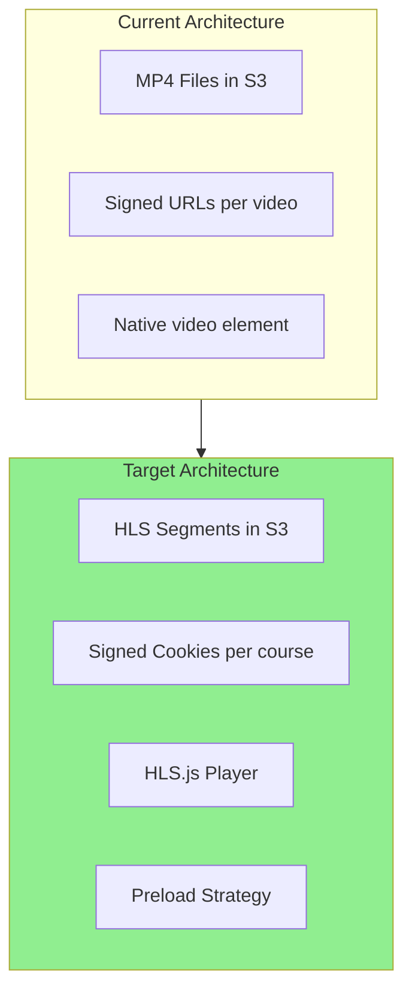
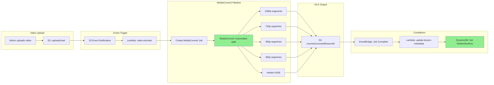
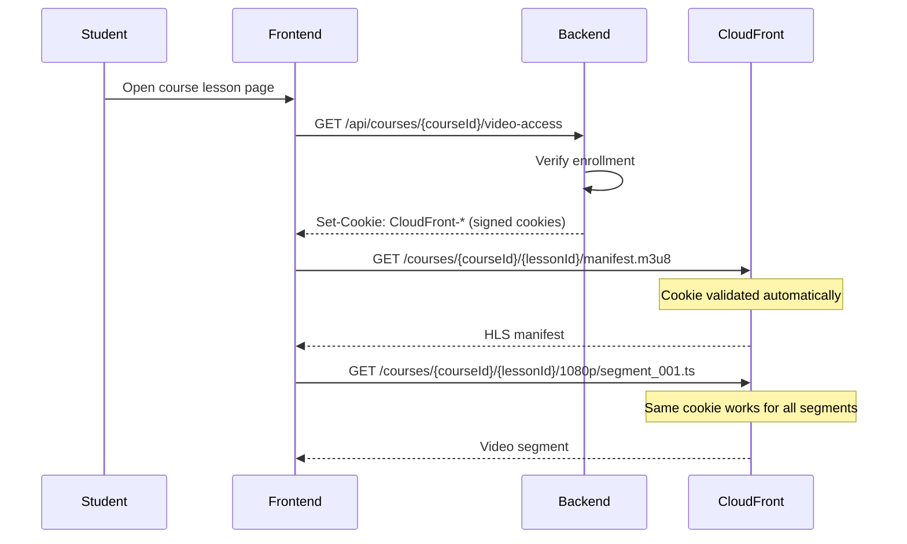
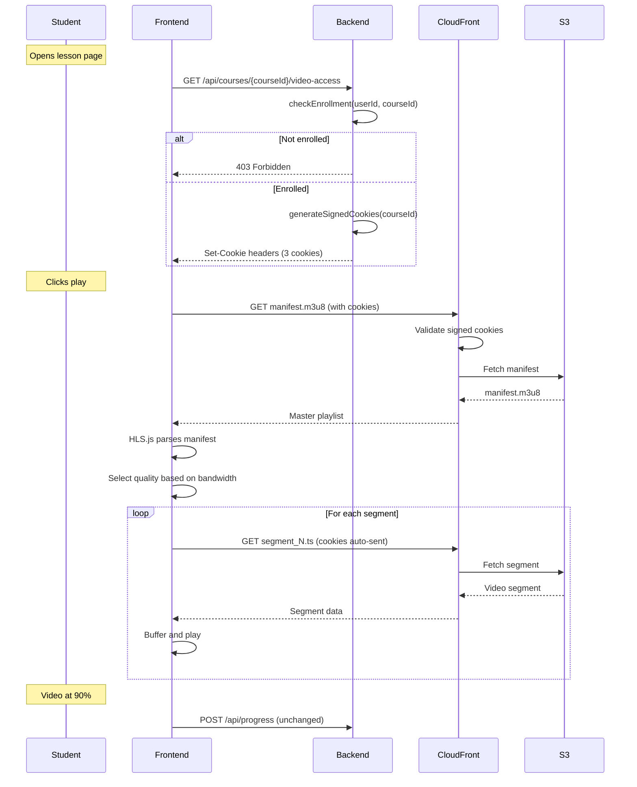
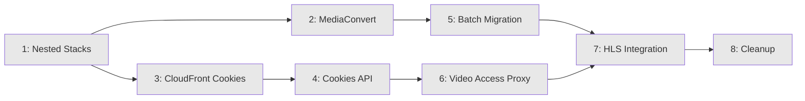
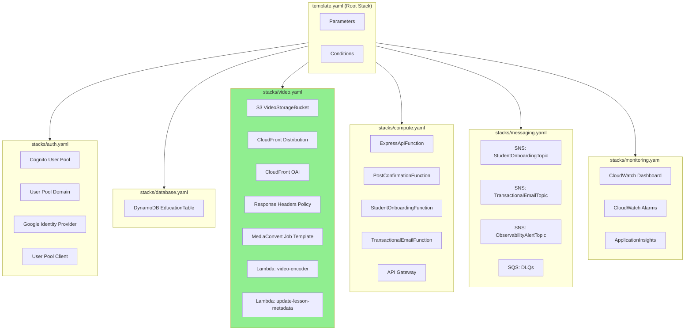

# Ultra-Fast Protected Video Streaming

> Transform video delivery from direct MP4 files to HLS streaming with signed cookies, achieving instant playback for enrolled students.

## Problem Statement

**Current State**: Videos are delivered as single MP4 files via signed URLs. Each video request generates a new CloudFront signed URL with 30-minute expiry. The native HTML5 `<video>` element plays these directly.

**Pain Points**:
1. **Slow start times** - Browser must download enough of the MP4 before playback begins
2. **No adaptive quality** - Single quality level regardless of network conditions
3. **Signed URL per request** - Every video generates a new URL (hundreds of requests for HLS would be impractical)
4. **No preloading strategy** - Next lesson loads from scratch when clicked

**Desired State**: Sub-second video start times with adaptive quality streaming that automatically adjusts to network conditions, using signed cookies for seamless HLS segment access.

---

## Objectives

1. **Instant playback** - Video starts within 1 second of user click
2. **Adaptive quality** - Automatic quality adjustment based on network (1080p → 360p)
3. **Seamless seeking** - Jump anywhere in video without buffering delay
4. **Protected content** - Enrollment verification maintained for all video access
5. **Tab behavior preserved** - Pause on tab away, resume where left off
6. **Progress tracking preserved** - Mark complete at 90% watched

---

## User Stories

### Student Experience
- **As a student**, I want the lesson video to start playing immediately so I don't lose focus waiting for buffering
- **As a student on slow wifi**, I want the video quality to automatically adjust so playback doesn't stutter
- **As a student**, I want to seek to any point in the video without waiting for it to load
- **As a student**, I want the next lesson to load instantly when I click it

### Creator/Admin Experience
- **As a course creator**, I want my videos protected so only enrolled students can watch
- **As an admin**, I want efficient storage and bandwidth costs without sacrificing quality

---

## Architecture Overview



### Key Changes

| Component | Current | Target |
|-----------|---------|--------|
| **Video Format** | Single MP4 file | HLS segments (.m3u8 + .ts/.fmp4) |
| **Encoding** | Original upload quality | Automated ABR ladder (360p-1080p) |
| **Access Control** | Signed URL per video | Signed Cookie per course path |
| **Player** | Native `<video>` | HLS.js with native Safari fallback |
| **Preloading** | None | Prefetch next lesson manifest |

---

## System Components

### 1. Video Encoding Pipeline (AWS MediaConvert)

**Purpose**: Convert uploaded videos to HLS format with adaptive bitrate.

**Input**: Original video file (MP4, MOV, etc.) uploaded to S3
**Output**: HLS package with multiple quality renditions



**S3 Output Structure**:
```
s3://learnermax-videos-{env}/
├── uploads/
│   └── raw/                    # Original uploads (temp)
│       └── {uploadId}.mp4
└── courses/
    └── {courseId}/
        └── {lessonId}/
            ├── master.m3u8         # Master playlist
            ├── 1080p/
            │   ├── playlist.m3u8   # Quality-specific playlist
            │   └── segment_*.ts    # Video segments (4 seconds each)
            ├── 720p/
            │   ├── playlist.m3u8
            │   └── segment_*.ts
            ├── 480p/
            │   └── ...
            └── 360p/
                └── ...
```

**Encoding Settings**:
- **Automated ABR**: MediaConvert analyzes video complexity, creates optimal renditions
- **Max renditions**: 4 (360p, 480p, 720p, 1080p) - no quality cap
- **Segment duration**: 4 seconds (balance between latency and efficiency)
- **GOP size**: 2 seconds (enables fast seeking)
- **Codec**: H.264 (AVC) for maximum compatibility

### 2. Signed Cookies for HLS Access

**Purpose**: Single cookie grants access to all video segments under a course path.

**Why Cookies over URLs**:
- HLS streaming requests hundreds of segment files
- Signed URL per segment = impractical (URL in manifest would need re-signing)
- Signed cookie covers entire path: `/courses/{courseId}/*`



**Cookie Structure**:
- `CloudFront-Policy`: Base64-encoded JSON policy
- `CloudFront-Signature`: RSA signature
- `CloudFront-Key-Pair-Id`: Key pair identifier
- **Path**: `/courses/{courseId}/*` (all lessons in course)
- **Expiry**: Session cookie (no `Expires`/`Max-Age` - deleted when browser closes)

**Why Session Cookies** (AWS recommended):
- Zero refresh logic needed - issue once per page load
- No mid-playback interruptions
- Perfect for binge-watching sessions
- Enrollment verified at cookie issuance time
- Most secure - cookie deleted when browser closes

### 3. HLS.js Video Player

**Purpose**: Replace native `<video>` element with HLS.js for adaptive streaming.

**Why HLS.js**:
- ~50KB bundle (vs ~100KB for Video.js)
- Web Worker support for background processing
- Native HLS fallback on Safari
- Better buffer management and ABR switching

**Configuration for VOD**:
```typescript
const hls = new Hls({
  enableWorker: true,           // Offload parsing to Web Worker
  lowLatencyMode: false,        // Not needed for VOD
  backBufferLength: 30,         // Keep 30s behind for back-seeking
  maxBufferLength: 60,          // Buffer 60s ahead
  startLevel: -1,               // Auto-select initial quality
  abrEwmaDefaultEstimate: 500000, // Assume 500kbps initially
});
```

---

## File Changes Overview

### Backend (New/Modified)

| File | Change |
|------|--------|
| `backend/src/features/video-access/video-access.service.ts` | **NEW**: Generate signed cookies |
| `backend/src/features/video-access/video-access.routes.ts` | **NEW**: `/api/courses/:courseId/video-access` endpoint |
| `backend/src/lib/cloudfront-cookies.ts` | **NEW**: CloudFront cookie signing utilities |
| `backend/src/features/lessons/lesson.types.ts` | **UPDATE**: Add `hlsManifestKey` field |
| `backend/src/features/lessons/lesson.service.ts` | **UPDATE**: Return HLS manifest path |

### Frontend (New/Modified)

| File | Change |
|------|--------|
| `frontend/proxy.ts` | **UPDATE**: Add video access cookie logic |
| `frontend/components/course/VideoPlayer.tsx` | **UPDATE**: Use HLS.js, receive manifestUrl prop |
| `frontend/components/course/CourseVideoSection.tsx` | **UPDATE**: Construct manifestUrl from hlsManifestKey |
| `frontend/types/lessons.ts` | **UPDATE**: Add `hlsManifestKey` to LessonResponse |

### Infrastructure (New)

| Resource | Purpose |
|----------|---------|
| MediaConvert Job Template | HLS encoding with Automated ABR |
| S3 Bucket Policy | Allow CloudFront access to HLS segments |
| CloudFront Behavior | Cookie-based access for `/courses/*` path |
| Lambda (optional) | Trigger encoding on video upload |

---

## Data Flow: Video Playback



---

## Security Model

### Enrollment Verification
- Cookies only issued after `enrollmentService.checkEnrollment()` passes
- Cookie path scoped to specific course: `/courses/{courseId}/*`
- Cannot access other courses with same cookie

### Session Cookie Lifecycle
- **Duration**: Browser session (no explicit expiry)
- **Issuance**: On course page load, after enrollment verification
- **Deletion**: When browser fully closes
- **No renewal needed**: Cookie valid for entire viewing session

### Error Handling
- **403 from CloudFront**: Cookie missing or browser was closed
  - Redirect to course page to re-issue cookies
  - Check enrollment status (may have been revoked)
- **Network errors**: HLS.js handles retry automatically

---

## Slices

This feature is implemented in 8 slices, each with clear intent and dependencies.



| Slice | Name | Intent | Dependencies |
|-------|------|--------|--------------|
| 1 | Nested Stacks Refactor | Split template.yaml for maintainability | None |
| 2 | MediaConvert Pipeline | Enable HLS encoding on video upload | Slice 1 |
| 3 | CloudFront Cookies | Configure cookie-based HLS access | Slice 1 |
| 4 | Cookies Backend API | Endpoint to issue signed cookies, return hlsManifestKey | Slice 3 |
| 5 | Batch Video Migration | Encode existing MP4s to HLS | Slice 2 |
| 6 | Video Access Proxy | Next.js proxy sets CloudFront cookies before page render | Slice 4 |
| 7 | HLS Integration | Replace native player with HLS.js | Slices 5, 6 |
| 8 | Cleanup | Remove legacy code and MP4 files | Slice 7 |

See `slices/` folder for detailed specs per slice.

---

## Success Metrics

| Metric | Current | Target |
|--------|---------|--------|
| Time to first frame | 2-4 seconds | < 1 second |
| Buffering events per video | 3-5 | < 1 |
| Quality switches (seamless) | N/A | Automatic |
| Storage cost | 100% | ~60% (ABR removes unused qualities) |
| Bandwidth cost | 100% | ~70% (lower qualities for poor connections) |

---

## Dependencies & Constraints

### AWS Services Required
- **MediaConvert**: Video encoding to HLS
- **S3**: Storage for HLS segments
- **CloudFront**: CDN with signed cookie support
- **Secrets Manager**: Store CloudFront signing key (existing)

### Frontend Requirements
- **HLS.js**: ~50KB additional bundle size
- **Browser support**: All modern browsers (Safari has native HLS)

### Preserved Behaviors
- Tab pause/resume (Page Visibility API) - unchanged
- Progress tracking at 90% - unchanged
- Enrollment check before access - moved to cookie issuance
- Video error handling - adapted for HLS errors

---

## Out of Scope

1. **DRM (Widevine/FairPlay)** - Not needed for current use case; signed cookies provide sufficient protection
2. **Live streaming** - VOD only
3. **Offline download** - Browser-based streaming only
4. **Mobile apps** - Web focus; native apps would use different approach
5. **Video analytics** - Quality metrics, buffer health (future enhancement)

---

## Infrastructure: Nested Stacks

Refactor `template.yaml` (~960 lines) into domain-based nested stacks for maintainability.



**BEFORE (Today)**:
```
backend/
└── template.yaml              # ~960 lines, all resources
```

**AFTER (Tomorrow)**:
```
backend/
├── template.yaml              # Root stack (~100 lines) - parameters, nested stack refs
└── stacks/
    ├── auth.yaml              # Cognito resources
    ├── database.yaml          # DynamoDB
    ├── video.yaml             # S3, CloudFront, MediaConvert (NEW resources here)
    ├── compute.yaml           # Lambda functions, API Gateway
    ├── messaging.yaml         # SNS topics, SQS queues
    └── monitoring.yaml        # CloudWatch dashboard, alarms
```

**Cross-Stack References**:
- Root stack exports shared values (Environment, FrontendDomain)
- Nested stacks use `!GetAtt NestedStack.Outputs.ResourceArn` for dependencies
- Video stack depends on Database stack (for DynamoDB table name)
- Compute stack depends on Auth, Database, Video, Messaging stacks

---

## References

- [CloudFront Signed Cookies](https://docs.aws.amazon.com/AmazonCloudFront/latest/DeveloperGuide/private-content-signed-cookies.html)
- [MediaConvert Automated ABR](https://docs.aws.amazon.com/mediaconvert/latest/ug/auto-abr.html)
- [HLS.js Documentation](https://github.com/video-dev/hls.js)
- [Fast Video Playback (web.dev)](https://web.dev/fast-playback-with-preload/)
