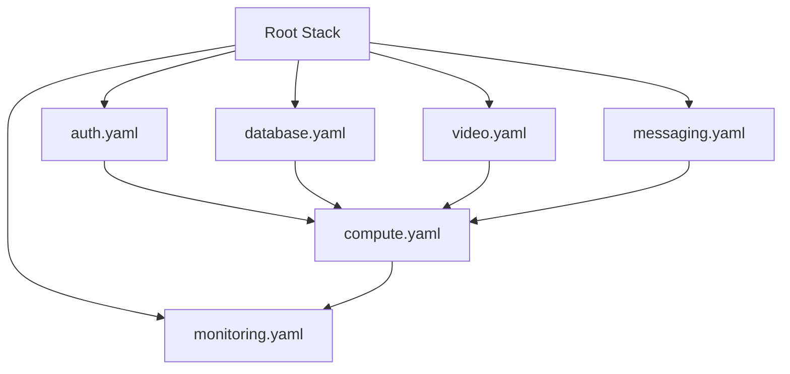

# Slice 1: Nested Stacks Refactor

## Objective

Refactor the monolithic `template.yaml` (~960 lines) into domain-based nested stacks for maintainability and to prepare for MediaConvert additions in Slice 2.

## Why This Slice First

- Foundation for all infrastructure changes in this feature
- Video stack will receive new MediaConvert resources (Slice 2)
- Reduces merge conflicts as the codebase grows
- Makes template.yaml easier to reason about

## Dependencies

None - this is the foundation slice.

---

## Deliverables

### Directory Structure

**BEFORE (Today):**
```
backend/
└── template.yaml              # ~960 lines, all resources
```

**AFTER (Tomorrow):**
```
backend/
├── template.yaml              # Root stack (~150 lines)
└── stacks/
    ├── auth.yaml              # Cognito resources (~100 lines)
    ├── database.yaml          # DynamoDB (~50 lines)
    ├── video.yaml             # S3, CloudFront (~100 lines)
    ├── compute.yaml           # Lambdas, API Gateway (~250 lines)
    ├── messaging.yaml         # SNS, SQS (~100 lines)
    └── monitoring.yaml        # CloudWatch (~200 lines)
```

### Resource Mapping

| Nested Stack | Resources to Extract |
|--------------|---------------------|
| `auth.yaml` | LearnerMaxUserPool, UserPoolDomain, GoogleIdentityProvider, UserPoolClient |
| `database.yaml` | EducationTable |
| `video.yaml` | VideoStorageBucket, VideoStorageBucketPolicy, VideoCloudFrontOAI, VideoCloudFrontDistribution, VideoResponseHeadersPolicy |
| `compute.yaml` | ExpressApiFunction, PostConfirmationFunction, StudentOnboardingFunction, TransactionalEmailFunction, ApiGatewayApi, PostConfirmationInvokePermission |
| `messaging.yaml` | StudentOnboardingTopic, StudentOnboardingDLQ, TransactionalEmailTopic, TransactionalEmailDLQ, ObservabilityAlertTopic |
| `monitoring.yaml` | ObservabilityDashboard, StudentOnboardingDLQAlarm, StudentOnboardingErrorAlarm, ApplicationResourceGroup, ApplicationInsightsMonitoring |

### Root Stack Pattern

```yaml
# template.yaml (root)
AWSTemplateFormatVersion: 2010-09-09
Transform: AWS::Serverless-2016-10-31

Parameters:
  Environment:
    Type: String
  FrontendDomain:
    Type: String
  # ... other params passed to nested stacks

Resources:
  AuthStack:
    Type: AWS::CloudFormation::Stack
    Properties:
      TemplateURL: ./stacks/auth.yaml
      Parameters:
        Environment: !Ref Environment
        FrontendDomain: !Ref FrontendDomain
        GoogleOAuthSecretArn: !Ref GoogleOAuthSecretArn

  DatabaseStack:
    Type: AWS::CloudFormation::Stack
    Properties:
      TemplateURL: ./stacks/database.yaml
      Parameters:
        Environment: !Ref Environment

  VideoStack:
    Type: AWS::CloudFormation::Stack
    Properties:
      TemplateURL: ./stacks/video.yaml
      Parameters:
        Environment: !Ref Environment
        FrontendDomain: !Ref FrontendDomain
        CloudFrontKeyGroupId: !Ref CloudFrontKeyGroupId

  # ... other stacks

Outputs:
  # Re-export nested stack outputs
  WebEndpoint:
    Value: !GetAtt ComputeStack.Outputs.WebEndpoint
```

### Cross-Stack Dependencies



---

## Acceptance Criteria

- [ ] `sam build` succeeds
- [ ] `sam deploy` creates all resources
- [ ] All existing outputs still exported
- [ ] No resource replacements (same logical IDs preserved)
- [ ] E2E tests pass (backend unchanged functionally)

---

## Forward Requirements for Slice 2

- Video stack must export `VideoStorageBucketName` and `CloudFrontDistributionId`
- Video stack parameters should include placeholders for MediaConvert IAM role
