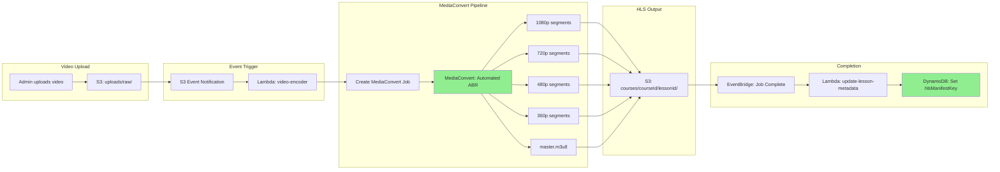

# Slice 2: MediaConvert Encoding Pipeline

## Objective

Set up the AWS MediaConvert encoding pipeline that converts uploaded videos to HLS format with adaptive bitrate. This enables the performance gains from HLS streaming.

## Why This Slice

- HLS (HTTP Live Streaming) enables adaptive bitrate playback - quality adjusts to network conditions
- HLS uses small segments (4s each) instead of one large MP4 - faster start times
- MediaConvert's Automated ABR creates optimal quality renditions automatically
- This slice creates the infrastructure; Slice 5 will encode existing videos

## Dependencies

- Slice 1 (Nested Stacks) - video.yaml must exist to add these resources

---

## System Flow



---

## Deliverables

### 2.1 New Lambda Workspace

```
backend/
└── video-encoder/
    ├── package.json
    ├── tsconfig.json
    └── src/
        ├── handler.ts           # S3 trigger -> create MediaConvert job
        ├── update-metadata.ts   # EventBridge -> update DynamoDB
        └── mediaconvert-job.ts  # Job template configuration
```

### 2.2 SAM Resources (in `stacks/video.yaml`)

```yaml
# IAM Role for MediaConvert
MediaConvertRole:
  Type: AWS::IAM::Role
  Properties:
    AssumeRolePolicyDocument:
      Version: '2012-10-17'
      Statement:
        - Effect: Allow
          Principal:
            Service: mediaconvert.amazonaws.com
          Action: sts:AssumeRole
    Policies:
      - PolicyName: MediaConvertAccess
        PolicyDocument:
          Version: '2012-10-17'
          Statement:
            - Effect: Allow
              Action:
                - s3:GetObject
                - s3:PutObject
              Resource: !Sub ${VideoStorageBucket.Arn}/*

# Lambda: Trigger encoding on S3 upload
VideoEncoderFunction:
  Type: AWS::Serverless::Function
  Properties:
    CodeUri: ../video-encoder/
    Handler: dist/handler.handler
    Runtime: nodejs22.x
    Timeout: 30
    Environment:
      Variables:
        MEDIACONVERT_ROLE_ARN: !GetAtt MediaConvertRole.Arn
        MEDIACONVERT_ENDPOINT: !Ref MediaConvertEndpoint
        OUTPUT_BUCKET: !Ref VideoStorageBucket
    Events:
      S3Upload:
        Type: S3
        Properties:
          Bucket: !Ref VideoStorageBucket
          Events: s3:ObjectCreated:*
          Filter:
            S3Key:
              Rules:
                - Name: prefix
                  Value: uploads/raw/

# Lambda: Update lesson metadata on encoding complete
UpdateLessonMetadataFunction:
  Type: AWS::Serverless::Function
  Properties:
    CodeUri: ../video-encoder/
    Handler: dist/update-metadata.handler
    Runtime: nodejs22.x
    Environment:
      Variables:
        EDUCATION_TABLE_NAME: !Ref EducationTableName
    Events:
      MediaConvertComplete:
        Type: EventBridgeRule
        Properties:
          Pattern:
            source:
              - aws.mediaconvert
            detail-type:
              - MediaConvert Job State Change
            detail:
              status:
                - COMPLETE
```

### 2.3 MediaConvert Job Configuration

```typescript
// backend/video-encoder/src/mediaconvert-job.ts
export const createJobSettings = (inputKey: string, outputPrefix: string) => ({
  Settings: {
    Inputs: [{
      FileInput: `s3://${process.env.OUTPUT_BUCKET}/${inputKey}`,
    }],
    OutputGroups: [{
      Name: "HLS",
      OutputGroupSettings: {
        Type: "HLS_GROUP_SETTINGS",
        HlsGroupSettings: {
          SegmentLength: 4,
          MinSegmentLength: 0,
          Destination: `s3://${process.env.OUTPUT_BUCKET}/${outputPrefix}/`,
          ManifestCompression: "NONE",
        },
      },
      AutomatedEncodingSettings: {
        AbrSettings: {
          MaxRenditions: 4,
          MaxAbrBitrate: 8000000,  // 8 Mbps max (1080p)
          MinAbrBitrate: 600000,   // 600 Kbps min (360p)
        },
      },
    }],
  },
});
```

### 2.4 S3 Output Structure

```
s3://learnermax-videos-{env}/
├── uploads/
│   └── raw/                    # Original uploads (temp)
│       └── {uploadId}.mp4
└── courses/
    └── {courseId}/
        └── {lessonId}/
            ├── master.m3u8         # Master playlist
            ├── 1080p/
            │   ├── playlist.m3u8   # Quality-specific playlist
            │   └── segment_*.ts    # Video segments (4 seconds each)
            ├── 720p/
            │   ├── playlist.m3u8
            │   └── segment_*.ts
            ├── 480p/
            │   └── ...
            └── 360p/
                └── ...
```

---

## Encoding Settings

| Setting | Value | Rationale |
|---------|-------|-----------|
| Automated ABR | Yes | MediaConvert analyzes video complexity, creates optimal renditions |
| Max renditions | 4 | 360p, 480p, 720p, 1080p |
| Segment duration | 4 seconds | Balance between latency and efficiency |
| GOP size | 2 seconds | Enables fast seeking |
| Codec | H.264 (AVC) | Maximum browser compatibility |

---

## Acceptance Criteria

- [ ] S3 upload to `uploads/raw/` triggers VideoEncoderFunction
- [ ] MediaConvert job starts with Automated ABR settings
- [ ] HLS output appears in `courses/{courseId}/{lessonId}/`
- [ ] EventBridge triggers UpdateLessonMetadataFunction on job complete
- [ ] DynamoDB lesson record updated with `hlsManifestKey`
- [ ] CloudWatch logs show encoding progress

---

## Forward Requirements for Slice 3

- HLS segments in S3 at `/courses/*` path pattern
- CloudFront needs to serve these with signed cookie access (not signed URLs)
