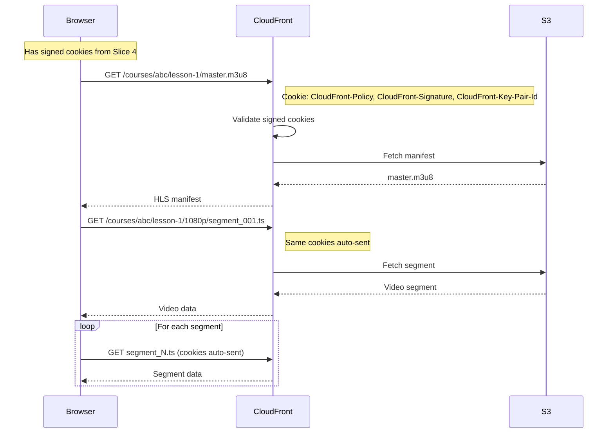

# Slice 3: CloudFront Signed Cookies Configuration

## Objective

Configure CloudFront to use signed cookies for HLS content access instead of signed URLs. This is essential because HLS streaming requests hundreds of segment files - signing each URL would be impractical.

## Why Signed Cookies

| Approach | For HLS? | Reason |
|----------|----------|--------|
| Signed URLs | No | HLS requests 100s of segments; can't embed signed URL in manifest |
| Signed Cookies | Yes | Single cookie grants access to entire `/courses/{courseId}/*` path |

**Key insight:** A signed cookie covers an entire path pattern. Once set, the browser automatically sends it with every segment request.

## Dependencies

- Slice 1 (Nested Stacks) - video.yaml exists
- HLS content will exist at `/courses/{courseId}/{lessonId}/*` (prepared for Slice 2)

---

## System Flow



---

## Deliverables

### 3.1 CloudFront Cache Behavior for HLS

Add a new cache behavior in `stacks/video.yaml` for the `/courses/*` path:

```yaml
VideoCloudFrontDistribution:
  Type: AWS::CloudFront::Distribution
  Properties:
    DistributionConfig:
      # ... existing config ...
      CacheBehaviors:
        # NEW: Behavior for HLS content with signed cookies
        - PathPattern: /courses/*
          TargetOriginId: S3VideoOrigin
          ViewerProtocolPolicy: redirect-to-https
          AllowedMethods: [GET, HEAD, OPTIONS]
          CachedMethods: [GET, HEAD]
          Compress: true
          CachePolicyId: 658327ea-f89d-4fab-a63d-7e88639e58f6  # CachingOptimized
          ResponseHeadersPolicyId: !Ref VideoResponseHeadersPolicy
          TrustedKeyGroups:
            - !Ref CloudFrontKeyGroupId
          # Forward cookies for signed cookie validation
          OriginRequestPolicyId: !Ref CookieForwardingPolicy

# Policy to forward CloudFront signed cookies to origin
CookieForwardingPolicy:
  Type: AWS::CloudFront::OriginRequestPolicy
  Properties:
    OriginRequestPolicyConfig:
      Name: !Sub ${Environment}-cloudfront-cookies
      CookiesConfig:
        CookieBehavior: whitelist
        Cookies:
          - CloudFront-Policy
          - CloudFront-Signature
          - CloudFront-Key-Pair-Id
      HeadersConfig:
        HeaderBehavior: none
      QueryStringsConfig:
        QueryStringBehavior: none
```

### 3.2 CORS Update for Credentials

Update the response headers policy to allow credentials (required for cookies):

```yaml
VideoResponseHeadersPolicy:
  Type: AWS::CloudFront::ResponseHeadersPolicy
  Properties:
    ResponseHeadersPolicyConfig:
      Name: !Sub ${Environment}-video-cors
      CorsConfig:
        AccessControlAllowOrigins:
          Items:
            - !Ref FrontendDomain
            - http://localhost:3000
        AccessControlAllowCredentials: true  # Required for cookies
        AccessControlAllowHeaders:
          Items:
            - "*"
        AccessControlAllowMethods:
          Items:
            - GET
            - HEAD
            - OPTIONS
        OriginOverride: true
```

### 3.3 Custom Domain Configuration

**Requirement:** Configure `video.learnwithrico.com` as the CloudFront alternate domain.

This is required for cookie sharing between the Next.js app (`learnwithrico.com`) and CloudFront (`video.learnwithrico.com`). Cookies set with `domain: .learnwithrico.com` will be sent to both.

```yaml
Parameters:
  # Existing parameters...
  CloudFrontKeyGroupId:
    Type: String
    Description: ID of CloudFront Key Group for signed cookies/URLs

  # NEW: Custom domain for video CDN
  VideoCdnDomain:
    Type: String
    Default: ""
    Description: Custom domain for video CDN (e.g., video.learnwithrico.com). Leave empty to use default CloudFront domain.

  VideoCdnCertificateArn:
    Type: String
    Default: ""
    Description: ACM certificate ARN for video CDN domain (must be in us-east-1). Required if VideoCdnDomain is set.

Conditions:
  HasCustomVideoDomain: !Not [!Equals [!Ref VideoCdnDomain, ""]]

Resources:
  VideoCloudFrontDistribution:
    Type: AWS::CloudFront::Distribution
    Properties:
      DistributionConfig:
        # ... existing config ...

        # NEW: Custom domain alias
        Aliases: !If
          - HasCustomVideoDomain
          - - !Ref VideoCdnDomain
          - !Ref AWS::NoValue

        # NEW: Custom SSL certificate
        ViewerCertificate: !If
          - HasCustomVideoDomain
          - AcmCertificateArn: !Ref VideoCdnCertificateArn
            SslSupportMethod: sni-only
            MinimumProtocolVersion: TLSv1.2_2021
          - CloudFrontDefaultCertificate: true
```

**DNS Configuration (manual):**
After deployment, create a CNAME record:
```
video.learnwithrico.com → <cloudfront-distribution-domain>.cloudfront.net
```

### 3.4 Key Group Configuration

The CloudFront Key Group must already exist (it should be in video.yaml from the current signed URL setup). Verify it's referenced.

---

## Cookie Structure (Reference for Slice 4)

The backend (Slice 4) will generate these cookies:

| Cookie | Purpose |
|--------|---------|
| `CloudFront-Policy` | Base64-encoded JSON policy (path, expiry) |
| `CloudFront-Signature` | RSA signature of the policy |
| `CloudFront-Key-Pair-Id` | Identifies which key pair signed this |

**Policy example:**
```json
{
  "Statement": [{
    "Resource": "https://video.learnwithrico.com/courses/course-123/*",
    "Condition": {
      "DateLessThan": {
        "AWS:EpochTime": 1704067200
      }
    }
  }]
}
```

---

## Acceptance Criteria

- [ ] CloudFront has `/courses/*` cache behavior with TrustedKeyGroups
- [ ] Cookie forwarding policy whitelists the 3 CloudFront cookies
- [ ] CORS allows credentials (`Access-Control-Allow-Credentials: true`)
- [ ] CORS allows origin `https://learnwithrico.com`
- [ ] Custom domain parameters added (`VideoCdnDomain`, `VideoCdnCertificateArn`)
- [ ] CloudFront configured with `video.learnwithrico.com` alias (when parameter provided)
- [ ] Without cookies: CloudFront returns 403 for `/courses/*` requests
- [ ] With valid cookies: CloudFront serves HLS content
- [ ] Deploy succeeds with no resource replacements

---

## Forward Requirements for Slice 4

- CloudFront domain exported for cookie generation
- Key pair ID available to backend for signing
- Backend needs to generate cookies scoped to `/courses/{courseId}/*`
