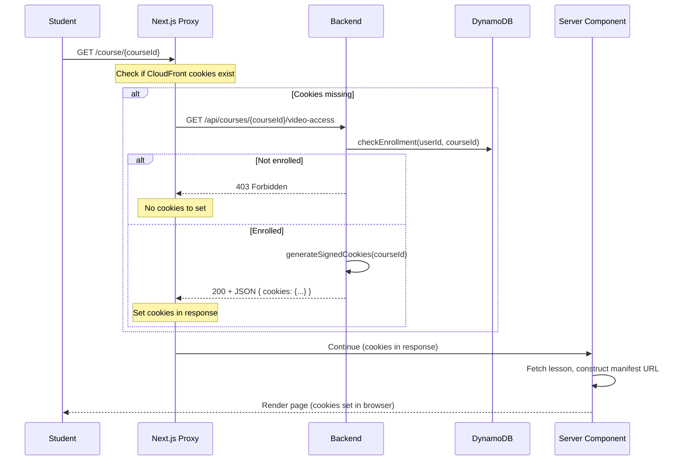

# Slice 4: Signed Cookies Backend API

## Objective

Create the backend service and endpoint to issue CloudFront signed cookies for enrolled students. This replaces the per-video signed URL approach with a per-course cookie approach.

## Why This Slice

- Enrollment must be verified before issuing video access
- Cookies scoped to course path (`/courses/{courseId}/*`) - one cookie serves all lessons
- Session cookies (no expiry) - deleted when browser closes, zero refresh logic needed
- Backend generates cookies; **Next.js Proxy sets them before page renders**

## Dependencies

- Slice 3 (CloudFront configured to accept signed cookies)

---

## System Flow



**Key Change**: Backend returns cookie **values as JSON**, not Set-Cookie headers. The Next.js Proxy is responsible for setting cookies with proper attributes (domain, path, etc.).

---

## Deliverables

### 4.1 CloudFront Cookie Signing Utility

**File:** `backend/src/lib/cloudfront-cookies.ts`

```typescript
import { getSignedCookies } from '@aws-sdk/cloudfront-signer';

export interface SignedCookies {
  'CloudFront-Policy': string;
  'CloudFront-Signature': string;
  'CloudFront-Key-Pair-Id': string;
}

export async function generateSignedCookies(
  courseId: string,
  privateKey: string,
  keyPairId: string,
  cloudfrontDomain: string
): Promise<SignedCookies> {
  const policy = {
    Statement: [{
      Resource: `https://${cloudfrontDomain}/courses/${courseId}/*`,
      Condition: {
        DateLessThan: {
          // Session cookie - no explicit expiry in cookie, but policy needs one
          // Set to 24 hours as a safety net (cookie deleted on browser close anyway)
          'AWS:EpochTime': Math.floor(Date.now() / 1000) + 86400,
        },
      },
    }],
  };

  return getSignedCookies({
    policy: JSON.stringify(policy),
    privateKey,
    keyPairId,
  });
}
```

### 4.2 Video Access Service

**File:** `backend/src/features/video-access/video-access.service.ts`

```typescript
import { generateSignedCookies, SignedCookies } from '../../lib/cloudfront-cookies';
import { enrollmentService } from '../enrollment/enrollment.service';
import { getPrivateKey } from '../../lib/secrets';
import { ForbiddenError } from '../../lib/errors';

export class VideoAccessService {
  async getVideoAccessCookies(
    userId: string,
    courseId: string
  ): Promise<SignedCookies> {
    // Verify enrollment first
    const isEnrolled = await enrollmentService.checkEnrollment(userId, courseId);
    if (!isEnrolled) {
      throw new ForbiddenError('Not enrolled in this course');
    }

    // Get signing credentials from Secrets Manager
    const privateKey = await getPrivateKey();
    const keyPairId = process.env.CLOUDFRONT_KEY_PAIR_ID!;
    const cloudfrontDomain = process.env.CLOUDFRONT_DOMAIN!;

    // Generate signed cookies
    return generateSignedCookies(courseId, privateKey, keyPairId, cloudfrontDomain);
  }
}

export const videoAccessService = new VideoAccessService();
```

### 4.3 Video Access Routes

**File:** `backend/src/features/video-access/video-access.routes.ts`

```typescript
import { Router, Response } from 'express';
import { videoAccessService } from './video-access.service';
import { getUserIdFromContext } from '../../lib/auth';

const router = Router();

// GET /api/courses/:courseId/video-access
// Returns signed cookie VALUES as JSON (Next.js Proxy sets them)
router.get('/courses/:courseId/video-access', async (req, res: Response) => {
  const userId = getUserIdFromContext(req);
  const { courseId } = req.params;

  const cookies = await videoAccessService.getVideoAccessCookies(userId, courseId);

  // Return cookie values as JSON - Proxy will set them with proper attributes
  res.json({
    success: true,
    cookies: {
      'CloudFront-Policy': cookies['CloudFront-Policy'],
      'CloudFront-Signature': cookies['CloudFront-Signature'],
      'CloudFront-Key-Pair-Id': cookies['CloudFront-Key-Pair-Id'],
    },
  });
});

export default router;
```

**Note**: The backend no longer sets cookies directly. It returns the signed values, and the Next.js Proxy sets them with the appropriate attributes (httpOnly, secure, sameSite, domain, path).

### 4.4 Update Lesson Types

**File:** `backend/src/features/lessons/lesson.types.ts`

```typescript
// BEFORE
export interface LessonEntity {
  // ... existing fields
  videoKey: string;  // S3 key for MP4
}

// AFTER
export interface LessonEntity {
  // ... existing fields
  videoKey: string;           // S3 key for MP4 (legacy, removed in Slice 8)
  hlsManifestKey?: string;    // S3 key for HLS manifest (e.g., courses/abc/lesson-1/master.m3u8)
}
```

### 4.5 Update Lesson API to Return hlsManifestKey

The Lesson API must return `hlsManifestKey` so the frontend can construct the manifest URL.

**File:** `backend/src/features/lessons/lesson.types.ts`

Update `LessonResponse` (the API response type):

```typescript
// BEFORE
export interface LessonResponse {
  lessonId: string;
  courseId: string;
  title: string;
  description?: string;
  lengthInMins?: number;
  order: number;
  isCompleted?: boolean;
  // videoKey intentionally excluded for security
}

// AFTER
export interface LessonResponse {
  lessonId: string;
  courseId: string;
  title: string;
  description?: string;
  lengthInMins?: number;
  order: number;
  isCompleted?: boolean;
  hlsManifestKey?: string;  // NEW: HLS manifest S3 key (when available)
}
```

**File:** `backend/src/features/lessons/lesson.service.ts`

Update `getLessonsByCourse()` to include `hlsManifestKey`:

```typescript
async getLessonsByCourse(courseId: string): Promise<LessonResponse[]> {
  const lessons = await this.lessonRepository.findByCourse(courseId);
  return lessons.map(lesson => ({
    lessonId: lesson.lessonId,
    courseId: lesson.courseId,
    title: lesson.title,
    description: lesson.description,
    lengthInMins: lesson.lengthInMins,
    order: lesson.order,
    hlsManifestKey: lesson.hlsManifestKey,  // NEW: Include for HLS playback
  }));
}
```

**File:** `frontend/types/lessons.ts`

Update the frontend type to match:

```typescript
export interface LessonResponse {
  lessonId: string;
  courseId: string;
  title: string;
  description?: string;
  lengthInMins?: number;
  order: number;
  isCompleted?: boolean;
  hlsManifestKey?: string;  // NEW: HLS manifest path from backend
}
```

---

## Cookie Characteristics

These attributes are set by the **Next.js Proxy**, not the backend:

| Property | Value | Rationale |
|----------|-------|-----------|
| `httpOnly` | true | Prevents XSS from reading cookies |
| `secure` | true | HTTPS only |
| `sameSite` | none | Cross-origin (CDN domain differs from app domain) |
| `path` | / | Browser sends for all paths |
| `domain` | .learnwithrico.com | Shared between app and CloudFront subdomains |
| No `Expires`/`Max-Age` | Session | Deleted on browser close - most secure |

**Why session cookies?** (AWS recommended approach)
- Zero refresh logic needed - issue once per session
- No mid-playback interruptions
- Perfect for binge-watching sessions
- Most secure - cookie deleted when browser closes

---

## Environment Variables

Backend needs:
```
CLOUDFRONT_KEY_PAIR_ID=K1234567890ABC
CLOUDFRONT_DOMAIN=video.learnwithrico.com
```

**Note:** `CLOUDFRONT_DOMAIN` should come from CloudFormation (either the custom `VideoCdnDomain` parameter or the default CloudFront distribution domain). Cookie domain is set by the Next.js Proxy, not the backend.

---

## Acceptance Criteria

- [ ] `GET /api/courses/:courseId/video-access` returns 200 for enrolled user
- [ ] Response body contains `{ success: true, cookies: { ... } }` with all 3 cookie values
- [ ] `GET /api/courses/:courseId/video-access` returns 403 for non-enrolled user
- [ ] CloudFront accepts cookies and serves HLS content (tested with Proxy in Slice 6)
- [ ] `GET /api/courses/:courseId/lessons` returns `hlsManifestKey` for each lesson
- [ ] Frontend `LessonResponse` type includes `hlsManifestKey`

---

## Forward Requirements for Slice 6

- Next.js Proxy calls video-access endpoint when CloudFront cookies are missing
- Proxy extracts cookie values from JSON response
- Proxy sets cookies with proper attributes (httpOnly, secure, sameSite, domain)
- Cookies are set before page renders - no client-side loading state needed

## Forward Requirements for Slice 7

- Lesson API returns `hlsManifestKey` in each lesson object
- Frontend can construct manifest URL: `https://${CLOUDFRONT_DOMAIN}/${lesson.hlsManifestKey}`
- VideoPlayer receives `manifestUrl` as prop from CourseVideoSection
