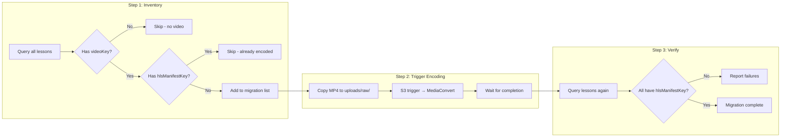

# Slice 5: Batch Video Migration

## Objective

Encode all existing MP4 videos to HLS format and update lesson records with `hlsManifestKey`. This is a one-time migration to prepare existing content for the new HLS player.

## Why This Slice

- Existing videos are MP4 files - they need HLS encoding to benefit from adaptive streaming
- Slice 2 set up the encoding pipeline - this slice uses it
- All videos must have HLS before Slice 6 (frontend) can switch to HLS player
- Running batch encoding now lets us verify the pipeline works at scale

## Dependencies

- Slice 2 (MediaConvert pipeline ready and tested)

---

## Migration Flow



---

## Deliverables

### 5.1 Batch Encoding Script

**File:** `backend/scripts/batch-encode-videos.ts`

```typescript
#!/usr/bin/env npx ts-node

/**
 * One-time script to encode all existing MP4 videos to HLS format.
 *
 * Usage: npx ts-node scripts/batch-encode-videos.ts
 *
 * This script:
 * 1. Queries all lessons from DynamoDB
 * 2. Filters to lessons with videoKey but no hlsManifestKey
 * 3. Copies each MP4 to uploads/raw/ to trigger the encoding pipeline
 * 4. Reports progress and any errors
 */

import { DynamoDBClient } from '@aws-sdk/client-dynamodb';
import { S3Client, CopyObjectCommand } from '@aws-sdk/client-s3';
import { lessonRepository } from '../src/features/lessons/lesson.repository';

async function main() {
  console.log('Starting batch video encoding migration...\n');

  const lessons = await lessonRepository.getAllLessons();
  console.log(`Found ${lessons.length} total lessons\n`);

  const toMigrate = lessons.filter(l => l.videoKey && !l.hlsManifestKey);
  const alreadyMigrated = lessons.filter(l => l.hlsManifestKey);
  const noVideo = lessons.filter(l => !l.videoKey);

  console.log(`Already migrated: ${alreadyMigrated.length}`);
  console.log(`No video: ${noVideo.length}`);
  console.log(`To migrate: ${toMigrate.length}\n`);

  if (toMigrate.length === 0) {
    console.log('Nothing to migrate. All lessons are up to date!');
    return;
  }

  console.log('Starting encoding jobs...\n');

  for (const lesson of toMigrate) {
    // Copy MP4 to uploads/raw/ to trigger encoding pipeline
    const uploadKey = `uploads/raw/${lesson.courseId}/${lesson.lessonId}.mp4`;

    console.log(`[${lesson.lessonId}] Triggering encoding...`);
    try {
      await copyToUploadsBucket(lesson.videoKey, uploadKey);
      console.log(`[${lesson.lessonId}] ✓ Encoding triggered`);
    } catch (error) {
      console.error(`[${lesson.lessonId}] ✗ Failed: ${error.message}`);
    }
  }

  console.log('\n---');
  console.log('Batch encoding triggered. Monitor MediaConvert console for progress.');
  console.log('Run verify-hls-encoding.ts after jobs complete to check status.');
}

async function copyToUploadsBucket(sourceKey: string, destKey: string) {
  const s3 = new S3Client({});
  const bucket = process.env.VIDEO_BUCKET!;

  await s3.send(new CopyObjectCommand({
    Bucket: bucket,
    CopySource: `${bucket}/${sourceKey}`,
    Key: destKey,
  }));
}

main().catch(console.error);
```

### 5.2 Verification Script

**File:** `backend/scripts/verify-hls-encoding.ts`

```typescript
#!/usr/bin/env npx ts-node

/**
 * Verify all lessons have HLS encoding complete.
 *
 * Usage: npx ts-node scripts/verify-hls-encoding.ts
 */

import { lessonRepository } from '../src/features/lessons/lesson.repository';
import { S3Client, HeadObjectCommand } from '@aws-sdk/client-s3';

async function verify() {
  console.log('Verifying HLS encoding status...\n');

  const lessons = await lessonRepository.getAllLessons();

  const withVideo = lessons.filter(l => l.videoKey);
  const withHls = lessons.filter(l => l.hlsManifestKey);
  const missing = lessons.filter(l => l.videoKey && !l.hlsManifestKey);

  console.log(`Lessons with video: ${withVideo.length}`);
  console.log(`Lessons with HLS: ${withHls.length}`);
  console.log(`Missing HLS: ${missing.length}\n`);

  if (missing.length === 0) {
    console.log('✅ All lessons have HLS encoding');
    return;
  }

  console.log('❌ Missing HLS encoding:');
  for (const lesson of missing) {
    console.log(`  - ${lesson.lessonId} (course: ${lesson.courseId})`);
  }

  // Optionally verify manifests exist in S3
  console.log('\nVerifying manifest files exist in S3...');
  const s3 = new S3Client({});
  const bucket = process.env.VIDEO_BUCKET!;

  for (const lesson of withHls.slice(0, 5)) { // Check first 5
    try {
      await s3.send(new HeadObjectCommand({
        Bucket: bucket,
        Key: lesson.hlsManifestKey,
      }));
      console.log(`  ✓ ${lesson.lessonId}: manifest exists`);
    } catch (error) {
      console.log(`  ✗ ${lesson.lessonId}: manifest NOT FOUND`);
    }
  }
}

verify().catch(console.error);
```

### 5.3 CloudWatch Dashboard (Optional)

Add metrics to monitor encoding progress:

- Total lessons count
- Lessons with `hlsManifestKey` count
- MediaConvert jobs in progress
- MediaConvert job failures

---

## Execution Plan

1. **Dry run first** - List what would be migrated without triggering:
   ```bash
   DRY_RUN=true npx ts-node scripts/batch-encode-videos.ts
   ```

2. **Trigger encoding** - Start all MediaConvert jobs:
   ```bash
   npx ts-node scripts/batch-encode-videos.ts
   ```

3. **Monitor** - Watch MediaConvert console for job progress

4. **Verify** - Confirm all lessons have HLS:
   ```bash
   npx ts-node scripts/verify-hls-encoding.ts
   ```

---

## Error Handling

| Error | Resolution |
|-------|------------|
| S3 copy fails | Check permissions, retry |
| MediaConvert job fails | Check CloudWatch logs, re-run for specific lesson |
| hlsManifestKey not updated | Check EventBridge → Lambda trigger, manually update if needed |

---

## Acceptance Criteria

- [ ] Script runs against preview environment first
- [ ] All lessons with `videoKey` now have `hlsManifestKey`
- [ ] HLS manifests exist in S3 at expected paths (`courses/{courseId}/{lessonId}/master.m3u8`)
- [ ] HLS playback works via CloudFront with signed cookies (manual test)
- [ ] No encoding failures in CloudWatch
- [ ] Original MP4 files still exist (needed until Slice 8)

---

## Forward Requirements for Slice 6

- All lessons must have `hlsManifestKey` populated
- Frontend will read `hlsManifestKey` to construct manifest URL
- Format: `https://${CLOUDFRONT_DOMAIN}/${lesson.hlsManifestKey}`
