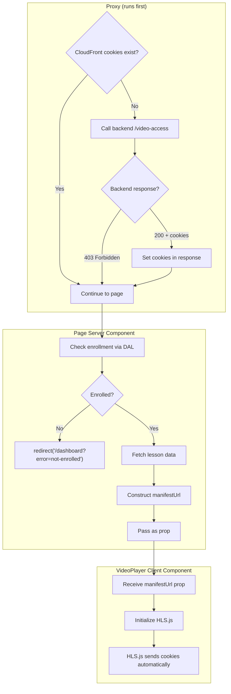

# Slice 6: Video Access Proxy

## Objective

Add a Next.js proxy that sets CloudFront signed cookies before course pages render. This enables seamless video playback without client-side cookie fetching.

## Why This Slice

- Cookies must be set BEFORE page renders for seamless video load
- `cookies().set()` cannot be called in Server Components (Next.js limitation)
- Proxy CAN set cookies via `response.cookies.set()`
- Backend verifies enrollment and returns cookie values
- This decouples video authentication from video playback

## Dependencies

- Slice 4 (Backend API `/api/courses/:courseId/video-access` that returns signed cookies)

---

## Next.js 16+ Proxy Convention

> **Note:** Starting with Next.js 16, `middleware.ts` is renamed to `proxy.ts` and the function is named `proxy`. This better reflects its purpose as a network boundary in front of the app.

| Convention | Value |
|------------|-------|
| File name | `proxy.ts` |
| Function export | `export function proxy()` or `export default function proxy()` |
| Location | Project root or `src/` folder (same level as `app`) |
| Matcher | Use `config.matcher` to target specific paths |

---

## Architecture: Proxy Sets Cookies, Page Constructs URL



**Benefits:**
- No client-side hooks for video access
- No loading states for video access
- Video URL ready at first render
- Cookies set before page renders
- Backend handles enrollment verification (not proxy)

---

## Deliverables

### 6.1 Merge Video Access into Existing Proxy

**File:** `frontend/proxy.ts`

> **Important:** This file already exists with NextAuth middleware exported. We need to **merge** video access logic, not replace the file.

**Current state:**
```typescript
export { auth as middleware } from '@/lib/auth';

export function proxy() {}

export const config = {
  matcher: ['/((?!api|_next/static|_next/image|favicon.ico).*)'],
};
```

**Target state:** Wrap the existing auth middleware with video access logic:

```typescript
import { NextResponse, type NextRequest } from 'next/server';
import { auth } from '@/lib/auth';

const BACKEND_URL = process.env.BACKEND_URL!;
const COOKIE_DOMAIN = process.env.COOKIE_DOMAIN!; // e.g., .learnwithrico.com

/**
 * Video access proxy - sets CloudFront cookies for course pages
 * Returns NextResponse with cookies if successful, null to continue to auth
 */
async function handleVideoAccess(request: NextRequest): Promise<NextResponse | null> {
  const { pathname } = request.nextUrl;

  // Only process course pages
  const courseMatch = pathname.match(/^\/course\/([^/]+)/);
  if (!courseMatch) {
    return null; // Not a course page, skip
  }

  const courseId = courseMatch[1];

  // Check if CloudFront cookies already exist
  if (request.cookies.has('CloudFront-Policy')) {
    return null; // Already have cookies, skip
  }

  // Get session token from request cookies (auth.js uses these cookie names)
  const sessionToken = request.cookies.get('authjs.session-token')?.value
    || request.cookies.get('__Secure-authjs.session-token')?.value;

  if (!sessionToken) {
    return null; // No session, let auth middleware handle
  }

  // Call backend to verify enrollment and get signed cookies
  try {
    const res = await fetch(`${BACKEND_URL}/api/courses/${courseId}/video-access`, {
      headers: {
        Authorization: `Bearer ${sessionToken}`,
      },
    });

    if (!res.ok) {
      return null; // Not enrolled or error, let page handle
    }

    const data = await res.json();

    // Set cookies in the response
    const response = NextResponse.next();

    const cookieOptions = {
      httpOnly: true,
      secure: true,
      sameSite: 'none' as const,
      path: '/',
      domain: COOKIE_DOMAIN,
      // No maxAge/expires = session cookie (deleted on browser close)
    };

    response.cookies.set('CloudFront-Policy', data.cookies['CloudFront-Policy'], cookieOptions);
    response.cookies.set('CloudFront-Signature', data.cookies['CloudFront-Signature'], cookieOptions);
    response.cookies.set('CloudFront-Key-Pair-Id', data.cookies['CloudFront-Key-Pair-Id'], cookieOptions);

    return response;
  } catch (error) {
    console.error('Failed to get video access cookies:', error);
    return null; // Continue without cookies, page will handle error
  }
}

// Combined middleware: video access + auth
export async function middleware(request: NextRequest) {
  // Try to set video access cookies first (for course pages)
  const videoResponse = await handleVideoAccess(request);
  if (videoResponse) {
    return videoResponse;
  }

  // Fall through to NextAuth middleware for auth handling
  return auth(request);
}

export const config = {
  matcher: ['/((?!api|_next/static|_next/image|favicon.ico).*)'],
};
```

**Key changes from current implementation:**
- Imports `auth` directly instead of re-exporting
- Wraps auth in a combined `middleware` function
- Video access runs first, then falls through to auth
- Uses `NextResponse.next()` with cookies only when setting new cookies

**Key points:**
- Proxy **never blocks** - always continues to auth via `return null` or to page via `NextResponse.next()`
- If cookies exist, no backend call needed (session cookies persist)
- If not enrolled or error, auth middleware runs and page handles redirect
- Cookie domain `.learnwithrico.com` allows sharing between `learnwithrico.com` and `video.learnwithrico.com`
- Keeps existing matcher for all routes (not just course pages)

### 6.2 Environment Variables

Add to `frontend/.env`:

```bash
COOKIE_DOMAIN=.learnwithrico.com
```

Note: `BACKEND_URL` should already exist.

---

## Error Handling

| Error | Cause | Handling |
|-------|-------|----------|
| No session token | User not logged in | Proxy continues; page redirects to `/signin` |
| Backend returns 403 | Not enrolled | Proxy continues; page redirects to `/dashboard?error=not-enrolled` |
| Backend fetch fails | Network error | Proxy continues; video may fail to load |
| Cookies already exist | Returning user | Proxy skips backend call |

---

## Acceptance Criteria

- [ ] Proxy sets CloudFront cookies on first visit to `/course/*` (for enrolled users)
- [ ] Proxy skips backend call if cookies already exist
- [ ] Proxy never blocks page load (always calls `NextResponse.next()`)
- [ ] Cookies have correct options: `httpOnly`, `secure`, `sameSite: 'none'`
- [ ] Cookie domain allows sharing across subdomains
- [ ] Non-course pages are not affected by proxy (matcher limits scope)

---

## Forward Requirements for Slice 7

- CloudFront cookies are set before VideoPlayer renders
- VideoPlayer can construct manifest URL and cookies will be sent automatically
- No client-side cookie fetching needed
